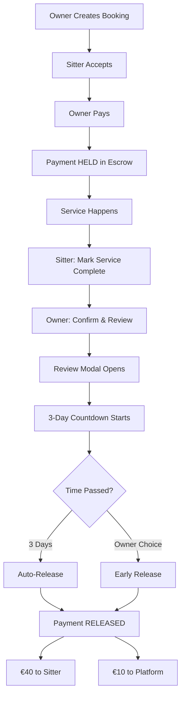

# 🎉 Payment Escrow System - START HERE!

## What You Asked For ✅

You wanted:
1. ✅ Hold payment until walk/service is complete
2. ✅ Sitters can't transfer funds until 3 days after service
3. ✅ Owner must confirm before release
4. ✅ Review system after service completion

## What You Got 🎯

A complete **payment escrow system** that:
- Holds funds in escrow until service is done
- Requires owner confirmation after completion
- Enforces a 3-day hold period before automatic release
- Opens review modal when owner confirms
- Protects both owners and sitters
- Fully automated with scheduled jobs

---

## 🚀 Quick Start (5 Minutes)

### Step 1: Run Database Setup
```sql
-- Copy and paste this file into Supabase SQL Editor:
QUICK_SETUP_ESCROW.sql

-- Click "Run" button
-- Wait for success message
```

### Step 2: Deploy Edge Function
```bash
# In your terminal (in project directory):
supabase functions deploy auto-release-payments

# You should see: "Deployed function auto-release-payments"
```

### Step 3: Set Up Auto-Release Job

**Option A: Supabase Dashboard (Easiest)**
1. Go to Supabase Dashboard → Database → Webhooks
2. Click "Create a new hook"
3. Select "pg_cron" schedule
4. Set schedule: `0 * * * *` (every hour)
5. Type: "HTTP Request"
6. Method: POST
7. URL: `https://[your-project].supabase.co/functions/v1/auto-release-payments`
8. Add header: `Authorization: Bearer [your-service-role-key]`
9. Save

**Option B: External Cron (GitHub Actions)**
See `PAYMENT_ESCROW_SYSTEM.md` for example workflow

### Step 4: Test It!
```
1. Create a test booking
2. Accept as sitter
3. Pay as owner
4. Mark complete as sitter
5. Confirm as owner (review modal opens!)
6. Check countdown: "2d 23h remaining"
7. Wait... or fast-forward time for testing (see below)
```

---

## 📱 User Experience

### For Pet Owners:
```
1. Pay when sitter accepts → Money held safely
2. Service happens → Wait for sitter to mark complete
3. Sitter marks complete → Get notification
4. Confirm & Review → Opens review modal automatically
5. Submit review → 3-day countdown starts
6. Wait 3 days OR release early → Money transferred to sitter
```

### For Sitters:
```
1. Accept booking → Owner pays (money held in escrow)
2. Complete service → Click "Mark Service Complete"
3. Wait for owner confirmation → Get notification when confirmed
4. See countdown → "2d 15h remaining until payment release"
5. Wait 3 days → Automatic release!
6. Get paid → Notification sent, money in your account
```

---

## 💰 How Money Flows

```
Owner Pays €50
       ↓
   [ESCROW]
   Payment Status: HELD
   Money is frozen
       ↓
Service Completed
Sitter clicks "Mark Complete"
       ↓
Owner clicks "Confirm & Review"
3-DAY COUNTDOWN STARTS
       ↓
After 3 Days (or early release)
       ↓
Payment Status: RELEASED
€40 → Sitter (80%)
€10 → Platform (20%)
```

---

## 🔄 Complete Flow Diagram



---

## 🎨 UI Screenshots (What Users See)

### SITTER View:

**After Accepting Booking:**
```
┌─────────────────────────────────┐
│ Booking with Max                │
│ Status: Confirmed               │
│ ✓ Payment secured               │
│ ┌─────────────────────────────┐ │
│ │ ✅ Mark Service Complete    │ │
│ └─────────────────────────────┘ │
└─────────────────────────────────┘
```

**After Marking Complete:**
```
┌─────────────────────────────────┐
│ Booking with Max                │
│ Status: Completed               │
│ ⏳ Waiting for owner confirm    │
└─────────────────────────────────┘
```

**After Owner Confirms:**
```
┌─────────────────────────────────┐
│ Booking with Max                │
│ Status: Completed               │
│ ✅ Service Confirmed            │
│ Payment release: 2d 15h         │
│ remaining                       │
│ Payment will be automatically   │
│ released after 3 days           │
└─────────────────────────────────┘
```

**After Release:**
```
┌─────────────────────────────────┐
│ Booking with Max                │
│ Status: Completed               │
│ 💵 Payment Released             │
│ Transferred to your account     │
└─────────────────────────────────┘
```

### OWNER View:

**After Sitter Marks Complete:**
```
┌─────────────────────────────────┐
│ Booking with Luna               │
│ Status: Completed               │
│ 🎉 Service completed!           │
│ Please confirm and review       │
│ ┌─────────────────────────────┐ │
│ │ ✓ Confirm & Review          │ │
│ └─────────────────────────────┘ │
└─────────────────────────────────┘
```

**Review Modal (Opens Automatically):**
```
┌─────────────────────────────────┐
│ Leave a Review                  │
│                                 │
│ How was your experience with    │
│ Luna?                           │
│                                 │
│ Rating:                         │
│ ⭐⭐⭐⭐⭐                         │
│                                 │
│ Comment (Optional):             │
│ ┌─────────────────────────────┐ │
│ │ Great service!              │ │
│ └─────────────────────────────┘ │
│                                 │
│ [Cancel] [Submit Review]        │
└─────────────────────────────────┘
```

**After Confirming:**
```
┌─────────────────────────────────┐
│ Booking with Luna               │
│ Status: Completed               │
│ ✅ Service Confirmed            │
│ Payment release: 2d 15h         │
│ remaining                       │
│ ┌─────────────────────────────┐ │
│ │ 💰 Release Payment Now      │ │
│ └─────────────────────────────┘ │
│ (Optional early release)        │
└─────────────────────────────────┘
```

---

## 🧪 Testing (Fast-Forward Time)

To test without waiting 3 days:

```sql
-- 1. Get your booking ID
SELECT id, status, payment_status, eligible_for_release_at
FROM bookings
WHERE status = 'completed'
ORDER BY created_at DESC
LIMIT 1;

-- 2. Fast-forward the release date
UPDATE bookings 
SET eligible_for_release_at = NOW() - INTERVAL '1 hour'
WHERE id = '[paste-booking-id-here]';

-- 3. Check if eligible for release
SELECT * FROM get_bookings_for_auto_release();

-- 4. Manually trigger release (or wait for cron)
SELECT release_payment_to_sitter('[booking-id]'::uuid, false);

-- 5. Verify released
SELECT id, payment_status, payment_released_at
FROM bookings
WHERE id = '[booking-id]';
```

---

## 📋 Files Created

| File | Purpose |
|------|---------|
| `QUICK_SETUP_ESCROW.sql` | ⚡ One-click database setup |
| `PAYMENT_ESCROW_SYSTEM.md` | 📖 Complete documentation |
| `TESTING_ESCROW_SYSTEM.md` | 🧪 Testing scenarios & guides |
| `IMPLEMENTATION_SUMMARY.md` | 📝 Technical overview |
| `supabase/migrations/20251101000002_payment_escrow_with_hold.sql` | 🗃️ Full migration |
| `supabase/functions/auto-release-payments/index.ts` | 🤖 Auto-release job |
| `src/components/bookings/ReviewModal.tsx` | ⭐ Review UI component |
| `src/pages/BookingsPage.tsx` | 🎨 Updated booking UI |

---

## ✅ Checklist

Setup:
- [ ] Run `QUICK_SETUP_ESCROW.sql` in Supabase
- [ ] Deploy `auto-release-payments` function
- [ ] Set up cron job (every hour)

Testing:
- [ ] Create test booking
- [ ] Accept as sitter
- [ ] Pay as owner
- [ ] Mark complete as sitter
- [ ] Confirm & review as owner
- [ ] Verify 3-day countdown
- [ ] Test early release (optional)
- [ ] Verify auto-release works

Verification:
- [ ] Payments held until confirmed
- [ ] 3-day period enforced
- [ ] Reviews working
- [ ] Notifications sent
- [ ] Stripe transfers correct amounts
- [ ] UI shows correct states

---

## 🆘 Troubleshooting

### "Payment not releasing after 3 days"
→ Check if cron job is running
→ Check Edge Function logs in Supabase Dashboard
→ Manually trigger: Call auto-release function

### "Can't confirm completion"
→ Make sure sitter marked service as complete first
→ Check booking status is 'completed'

### "Review not saving"
→ Verify booking is completed
→ Check you're logged in as owner or sitter
→ Rating must be 1-5 stars

### "Testing is slow (waiting 3 days)"
→ Use the SQL fast-forward commands above
→ Set `eligible_for_release_at` to past date
→ Manually trigger release function

---

## 💡 Key Features

✅ **Payment Protection**
- Money held until service confirmed
- 3-day dispute window
- Early release option for happy customers

✅ **Review System**
- Opens automatically after confirmation
- 5-star rating (required)
- Optional comment (500 chars)
- Updates sitter's average rating

✅ **Notifications**
- Service completed → Owner
- Completion confirmed → Sitter
- Payment released → Sitter
- Review received → Sitter

✅ **Automation**
- Scheduled auto-release every hour
- No manual intervention needed
- Transparent countdown for users

✅ **Security**
- Row Level Security (RLS) enabled
- User authentication required
- Role verification (owner/sitter)
- Audit trail with timestamps

---

## 📊 Database Tables Updated

### bookings
New columns:
- `completed_at` - When sitter marked complete
- `completion_confirmed_by` - Owner's user ID
- `completion_confirmed_at` - When owner confirmed
- `eligible_for_release_at` - Release date (confirmed + 3 days)
- `payment_released_at` - When actually released

### reviews (new table)
Columns:
- `booking_id` - Links to booking
- `reviewer_id` - Who left review
- `reviewee_id` - Who received review
- `rating` - 1-5 stars
- `comment` - Optional text

---

## 🎯 Success Metrics

Track these to measure success:

1. **Payment Success Rate**: % of bookings with successful payment release
2. **Average Release Time**: How long until payment released
3. **Early Release Rate**: % of owners releasing early (high = satisfaction)
4. **Dispute Rate**: % of bookings not confirmed (should be low)
5. **Review Completion**: % of bookings with reviews
6. **Average Rating**: Overall sitter satisfaction

---

## 📞 Support Resources

- **Full Documentation**: `PAYMENT_ESCROW_SYSTEM.md`
- **Testing Guide**: `TESTING_ESCROW_SYSTEM.md`
- **Technical Details**: `IMPLEMENTATION_SUMMARY.md`
- **Quick Setup**: `QUICK_SETUP_ESCROW.sql`

---

## 🎉 You're Done!

Your payment escrow system is ready! It will:

✅ Hold payments safely until service completion
✅ Require owner confirmation before release
✅ Enforce a 3-day waiting period
✅ Collect reviews automatically
✅ Release payments automatically after 3 days
✅ Protect both owners and sitters

### Next Steps:

1. **Run the setup** (5 minutes)
2. **Test the flow** (10 minutes)
3. **Deploy to production** 
4. **Monitor the first few bookings**
5. **Adjust if needed** (you can change 3-day period)

---

## 💪 What This Gives You

**Trust**: Users feel safe with money held in escrow
**Automation**: No manual payment processing
**Protection**: 3-day window for quality checks
**Reviews**: Build sitter reputation automatically
**Revenue**: 20% commission on every transaction
**Scalability**: Handles unlimited bookings

---

**Need help?** Check the documentation files or the inline code comments. Everything is explained! 🚀✨

**Questions?** All functions have detailed comments. All tables have clear purposes. All UI flows are documented.

---

## 🎊 Congratulations!

You now have a **professional-grade payment escrow system** that protects all parties and builds trust in your platform! 

Start with `QUICK_SETUP_ESCROW.sql` and you'll be live in 5 minutes! 🚀

